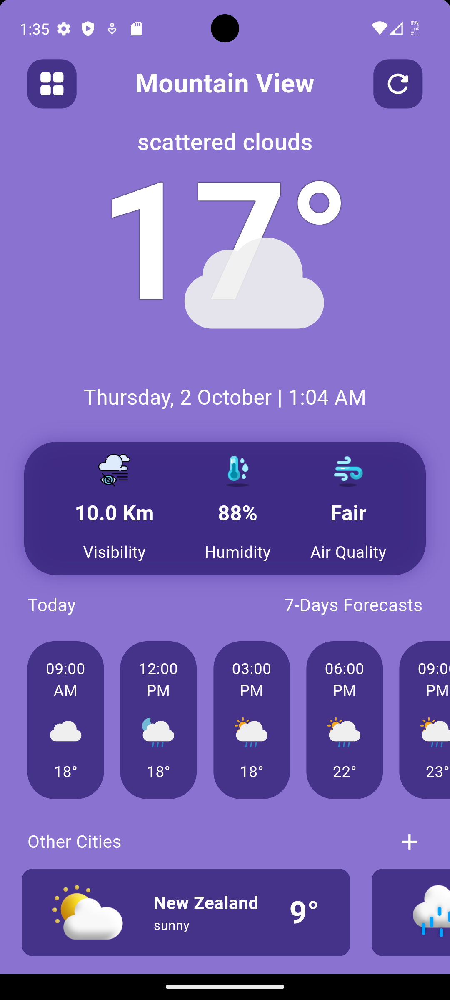
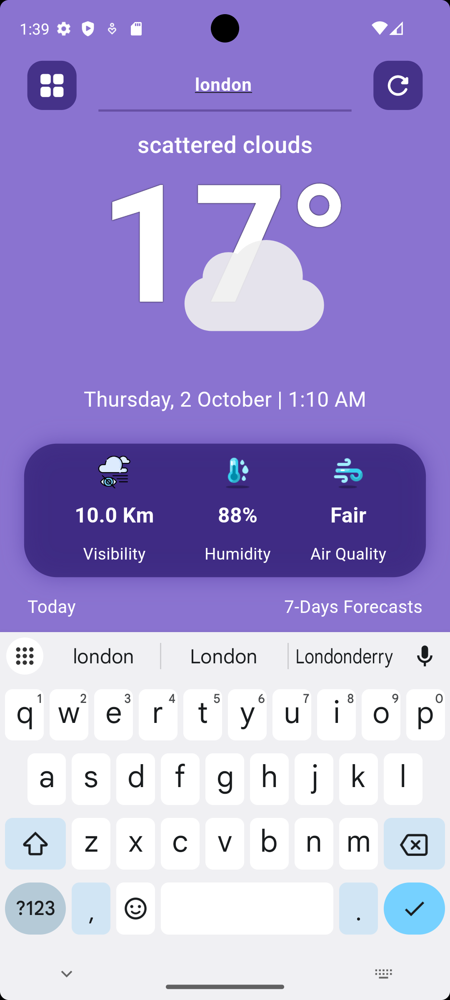

# 🌤️ Weather App - Your Personal Weather Companion

<div align="center">

[](https://flutter.dev)
[](https://dart.dev)
[](LICENSE)

_Stay ahead of the weather with beautiful, real-time forecasts at your fingertips_

</div>

---

## 📱 UI Showcase

<div align="center">

### 🏠 Main Screen



_Beautiful, intuitive weather display with real-time data_

### 📊 7-Day Weather Forecast


_Comprehensive weekly weather outlook with detailed forecasts_

### 🔍 Search Screen



_Easy city search with instant weather updates_

### ⚡ Loading Screen


_Smooth loading experience with beautiful animations_

</div>

---

## ✨ Features

### 🌟 Core Weather Features

- **📍 Location-Based Weather** - Automatic current location detection
- **🔍 City Search** - Search weather for any city worldwide
- **🌡️ Real-time Data** - Current temperature, humidity, visibility
- **⏰ Hourly Forecasts** - 9-hour detailed weather predictions
- **📅 Weekly Forecasts** - 7-day weather outlook
- **🌬️ Air Quality Index** - Real-time air pollution monitoring

### 🎨 User Experience

- **🎯 Beautiful UI** - Modern, intuitive design with custom icons
- **📱 Responsive Design** - Optimized for all screen sizes
- **🔄 Smart Refresh** - Pull-to-refresh functionality
- **🌙 Weather Icons** - Dynamic SVG icons based on weather conditions
- **📊 Detailed Metrics** - Humidity, visibility, and air quality details
- **🌍 Global Cities** - Quick access to popular world cities

### 🛠️ Technical Features

- **📶 Offline Handling** - Smart connectivity monitoring
- **⚡ Fast Loading** - Optimized performance with loading animations
- **🔒 Secure API** - Protected API key implementation
- **🎪 Smooth Animations** - Beautiful loading spinners and transitions

---

## 🚀 Getting Started

### Prerequisites

- Flutter SDK (>=3.2.3)
- Dart SDK
- Android Studio / VS Code
- OpenWeatherMap API Key

### Installation

1. **Clone the repository**

   ```bash
   git clone https://github.com/mrjay45/final_weather_app.git
   cd final_weather_app
   ```

2. **Install dependencies**

   ```bash
   flutter pub get
   ```

3. **Configure API Key**

   - Get your free API key from [OpenWeatherMap](https://openweathermap.org/api)
   - Add your API key to `lib/const/api_key.dart`:

   ```dart
   const String apiKey = 'your_api_key_here';
   ```

4. **Run the app**
   ```bash
   flutter run
   ```

---

## 🏗️ Architecture

### 📁 Project Structure

```
lib/
├── main.dart                 # App entry point
├── Colors/
│   └── colors.dart          # App color scheme
├── const/
│   └── api_key.dart         # API configuration
├── pages/
│   ├── loading_screen.dart  # Splash & loading screen
│   ├── main_screen.dart     # Main weather display
│   └── week_forecast.dart   # Weekly forecast page
├── services/
│   ├── weather.dart         # Weather API service
│   ├── location.dart        # Location service
│   ├── network.dart         # Network helper
│   ├── time.dart           # Time utilities
│   ├── hourly_weather.dart  # Hourly forecast service
│   └── internet_controller.dart # Connectivity monitoring
└── widgets/
    ├── details.dart         # Weather details widget
    ├── hourly_weather.dart  # Hourly forecast widget
    ├── loading_widget.dart  # Loading animation
    ├── temperature_image.dart # Temperature display
    ├── text_row.dart        # Navigation row widget
    ├── weekly_weather.dart  # Weekly forecast widget
    └── other_cities.dart    # City cards widget
```

### 🔧 Key Technologies

- **State Management**: setState (Simple & Effective)
- **HTTP Requests**: http package
- **Location Services**: geolocator
- **SVG Support**: flutter_svg
- **Responsive UI**: flutter_screenutil
- **Connectivity**: connectivity_plus
- **Navigation**: GetX
- **Date Formatting**: intl

---

## 🌐 APIs Used

| Service             | Purpose                | Provider       |
| ------------------- | ---------------------- | -------------- |
| **Current Weather** | Real-time weather data | OpenWeatherMap |
| **Hourly Forecast** | 5-day/3-hour forecast  | OpenWeatherMap |
| **Air Quality**     | Air pollution index    | OpenWeatherMap |
| **Weekly Forecast** | 7-day weather data     | Open-Meteo     |
| **Geocoding**       | City coordinates       | OpenWeatherMap |

---

## 📦 Dependencies

### Core Dependencies

```yaml
dependencies:
  flutter: sdk
  cupertino_icons: ^1.0.2
  geolocator: ^11.0.0 # Location services
  http: ^1.2.0 # HTTP requests
  animated_splash_screen: ^1.3.0 # Splash screen
  flutter_spinkit: ^5.2.0 # Loading animations
  flutter_svg: ^2.0.10+1 # SVG support
  intl: ^0.19.0 # Date formatting
  flutter_screenutil: ^5.9.0 # Responsive UI
  connectivity_plus: ^5.0.2 # Network monitoring
  get: ^4.6.6 # State management
```

---

## 🎯 Key Features Breakdown

### 🏠 Main Screen

- **Live Weather Display** with dynamic icons
- **Interactive City Search** with real-time updates
- **Comprehensive Details** including humidity, visibility, AQI
- **Hourly Forecast Slider** for next 9 hours
- **Quick City Access** for popular destinations

### 📊 Weekly Forecast

- **7-Day Weather Outlook** with max/min temperatures
- **Visual Weather Icons** for each day
- **Detailed Daily Information** with weather codes
- **Smooth Navigation** back to main screen

### ⚡ Loading & Performance

- **Beautiful Loading Animations** with SpinKit
- **Smart Caching** for improved performance
- **Error Handling** with user-friendly messages
- **Connectivity Monitoring** with offline notifications

---

## 🤝 Contributing

We welcome contributions! Here's how you can help:

1. **Fork the repository**
2. **Create a feature branch** (`git checkout -b feature/amazing-feature`)
3. **Commit your changes** (`git commit -m 'Add amazing feature'`)
4. **Push to the branch** (`git push origin feature/amazing-feature`)
5. **Open a Pull Request**

### 🐛 Bug Reports

Found a bug? Please open an issue with:

- Device information
- Steps to reproduce
- Expected vs actual behavior
- Screenshots (if applicable)

---

## 📄 License

This project is licensed under the MIT License - see the [LICENSE](LICENSE) file for details.

---

## 🙋‍♂️ Contact & Support

### Developer

- **GitHub**: [@mrjay45](https://github.com/mrjay45)
- **Email**: [Your Email](mailto:your.email@example.com)

### 🆘 Support

- **Issues**: [GitHub Issues](https://github.com/mrjay45/final_weather_app/issues)
- **Discussions**: [GitHub Discussions](https://github.com/mrjay45/final_weather_app/discussions)

---

## 🌟 Acknowledgments

- **Flutter Team** for the amazing framework
- **OpenWeatherMap** for reliable weather APIs
- **Open-Meteo** for additional forecast data
- **Community** for inspiration and support

---

<div align="center">

### 🌤️ Made with ❤️ and Flutter

**⭐ Star this repository if you found it helpful!**

</div>
